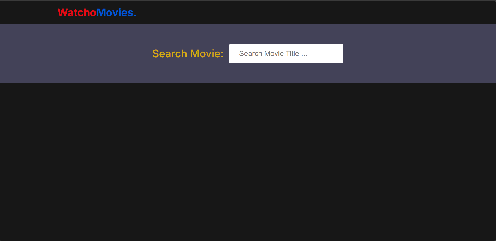
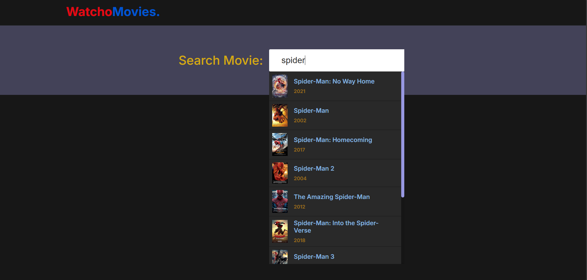
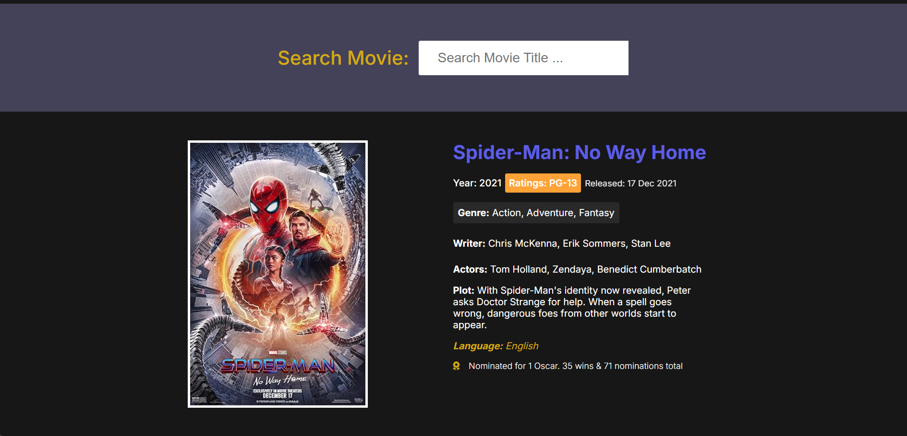

# WatchoMovies

Welcome to WatchoMovies, your go-to platform for discovering and exploring movies!

## Features
- **Search Movies**: Quickly find movies by title, year, genre, and more.
- **Movie Details**: View detailed information about movies including posters, cast, plot, and ratings.
- **User-Friendly Interface**: Easy navigation and a clean design to enhance your movie-watching experience.

## How to Use
1. **Search for a Movie**: Enter the movie title in the search box and press Enter.
2. **View Results**: Browse through the list of movies that match your search criteria.
3. **Select a Movie**: Click on a movie to view its details.

## Built With
- **HTML**: Structuring the web pages.
- **CSS**: Styling the web pages.
- **JavaScript**: Adding interactivity and fetching data from the OMDB API.
- **Netlify**: Hosting the website.

## Screenshots
### First Page

### Search Bar

### Movie Info

## Contributing
Feel free to contribute to the project by submitting pull requests or opening issues.

## License
This project is licensed under the MIT License - see the LICENSE file for details.

## Contact
If you have any questions or need further assistance, feel free to reach out to me at [shubhambendkhale77@gmail.com](shubhambendkhale77@gmail.com).

---

**Created by Shubham**
